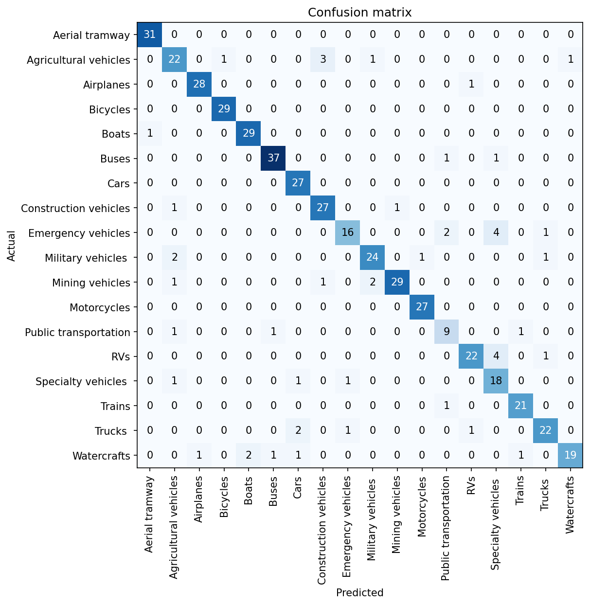

# Vechiles-Recognizer
In this proect i have build a **End-to-End Deep Learning model** from data collection, cleaning, model training, deployment and API integration.

This model can classify 20 different types of vehicles 

The types are following:

| Vehicles name | Vehicles name |
|--------|------|
| 1. Cars | 10. Agricultural vehicles |
| 2. Trucks | 11. Emergency vehicles |
| 3. Buses | 12. Military vehicles |
| 4. Motorcycles | 13. RVs |
| 5. Bicycles | 14. Watercrafts | 
| 6. Boats | 15. Specialty vehicles |
| 7. Airplanes | 16. Public transportation | 
| 8. Trains |  17. Aerial tramway |
| 9. Construction vehicles |  18. Mining vehicles |

## Dataset Preparation 

**Data Collection:** Downloaded from DuckDuckGo using term name.

**DataLoader:** Used fastai DataBlock API to set up the DataLoader.

**Data Augmentation:** fastai provides default data augmentation which operates in GPU.

Details can be found in notebooks/data_preprocessing.ipynb

## Training and Data Cleaning

**Training:** Fine-tuned a densnet169 model for 10 epochs and got upto ~90% accuracy.

**Data Cleaning:** This part took the highest time. Since I collected data from browser, there were many noises and same kind of vehicles.
I cleaned and updated data using fastai ImageClassifierCleaner. I cleaned the data each time after training or finetuning, except for the last time which was the final iteration of the model.

Here you can see the confusion matrix :

