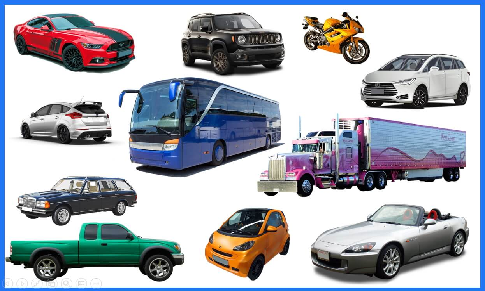

## This Image recognizer model Can classify 18 different types of vehicles

The types are following  

| Vehicles name | Vehicles name |
|--------|------|
| 1. Cars | 10. Agricultural vehicles |
| 2. Trucks | 11. Emergency vehicles |
| 3. Buses | 12. Military vehicles |
| 4. Motorcycles | 13. RVs |
| 5. Bicycles | 14. Watercrafts | 
| 6. Boats | 15. Specialty vehicles |
| 7. Airplanes | 16. Public transportation | 
| 8. Trains |  17. Aerial tramway |
| 9. Construction vehicles |  18. Mining vehicles |

 
 
 
 
 
 
 

